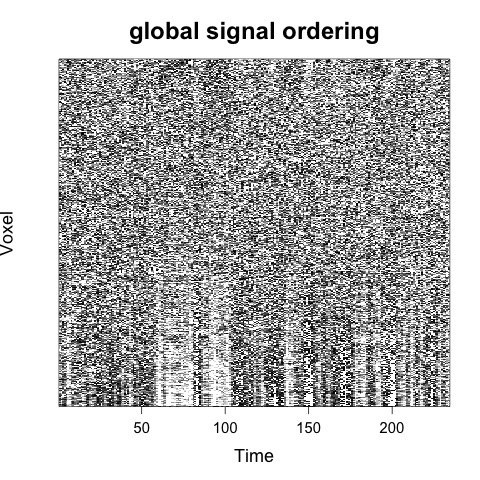
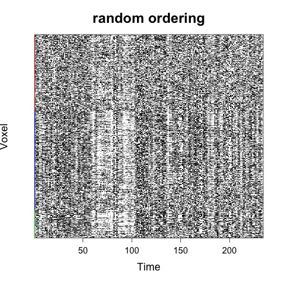

 \


#### `CarpetplotR.R` is a commandline tool written in R, for fast and easy visualization of fMRI data using carpet plots. 

## Installation \

Either download the `carpetplotR.R` script directly this git page, or using commandline:

```{sh eval=FALSE}
  wget  https://github.com/sidchop/carpetplotR/blob/main/carpetplotR.R
```

## Requirements \ 
 * R
 * The other required R CRAN packages ("optparse", "RColorBrewer", "matrixStats","shape", "RNifti") will be automatically downloaded and installed the first time you call `carpetplotR.R`.

## Inputs \
 * *[Required]* fMRI data file (.nii or .nii.gz format) 
 * *[Optional]* Tissue mask file where Grey matter = 1, white matter = 2 & csf = 3 (.nii or .nii.gz format). If you have used fmriprep to process your data, this can be the `${subj}_bold_space-${template}_dseg.nii.gz` file. If you do not provided this mask, a brain mask will be generated which will include all voxels with a mean value > 0.
 * *[Optional]* A text file with the global signal given as a vector. If you do not provide this, the global signal will be automatically calulared from the provided fMRI file.
 
## Usage \
 
 The most simple use of carpetplotR using defaults would be: \

```{sh eval=FALSE}
Rscript  carpetplotR.R -f fmri_file.nii.gz
```

Which would result in two carpetplot .jpeg files being generated, one with random voxel ordering and one with global signal ordering: \

```{r, echo = FALSE,warning=F, error=F, out.width='30%'}
knitr::include_graphics("man/sub-015c_random_ordering.jpeg")

```

For a discussion of voxel ordering in carpetplots see [here](https://bmhlab.github.io/DiCER_results/). \

If a tissue mask is provided, then voxels will first be ordered by tissue type: \
```{sh eval=FALSE}
Rscript  carpetplotR.R -f fmri_file.nii.gz -m mask_desg.nii.gz
```

```{r, echo = FALSE,warning=F, error=F, out.width='30%'}

knitr::include_graphics("man/sub-015c_ts_gs_ordering.jpeg")
```


There are lots of other options, which can be accessed by calling `carpetplot.R` without any options:
```{sh, eval=FALSE}
Rscript carpetplotR.R
```


```{sh, eval=FALSE}
Options:
	-f FILE, --file=FILE
		[Required] fMRI file in .nii or .nii.gz format.
 Mininal useage:

               Rscript carpetplotR.R -f fmri_file.nii.gz

	-m MASK, --mask=MASK
		[Optional] Tissue mask file in .nii or .nii.gz format which matches the dimentions of the fMRI file,
               where the voxels are labelled:  1=gm, 2=wm. 3=csf. If you have run fmriprep
               you can use the '${subj}_bold_space-${template}_dseg.nii.gz' file. If you provide a mask file,
               the voxels will first be sorted acording to tissue type.

	-o OUTPUT_FILENAME, --output_filename=OUTPUT_FILENAME
		Output file path and name [default= carperplot].
 E.g. 
               Rscript carpetplotR.R -f fmri_file.nii.gz -o "path/to/output/"

	-r CHARACTER, --ordering=CHARACTER
		Voxel ordering: random, gs (global signal) or both.
 E.g. -r "random, gs" [Default]

	-g GS, --gs=GS
		a .txt file with the global signal (gs), if not provided, gs will be extracted from provided fmri

	-i IMAGE, --image=IMAGE
		image device to use: "jpeg" [Default], png or tiff

	-l LIMITS, --limits=LIMITS
		[Optional] a sets a +upper and -lower z-score limit on the color bar. Default = 1.2. Stops outliers dominating colour scale

	-t TITLE, --title=TITLE
		[Optional] A title that will appear at the top of the plot. 

	-d DOWNSAMPLEFACTOR, --downsamplefactor=DOWNSAMPLEFACTOR
		[optional] downsample the image by a factor; WARNING: Currently this a very sime method of seleting the n'th timepoint. I would not use a downsamplefactor > 2 
```


### Report bugs or requests  
Don't hesitate to ask for support or new features using [github issues](https://github.com/sidchop/brainconn) or email me at sid.chopra@monash.edu.