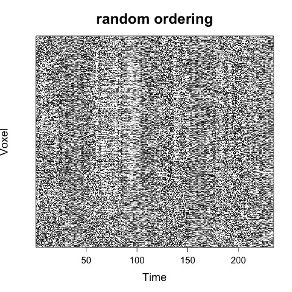
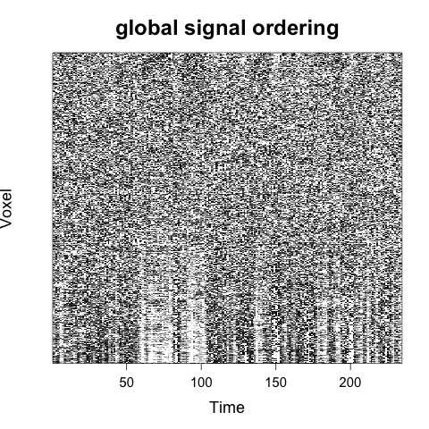
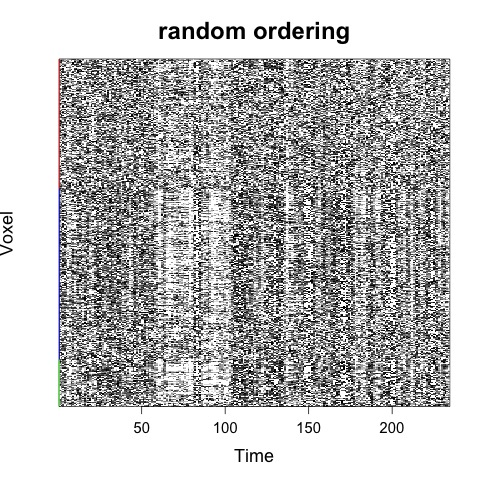
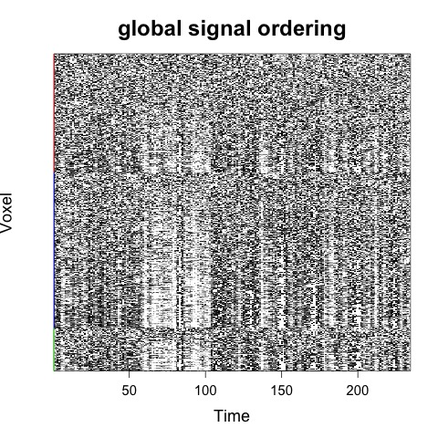
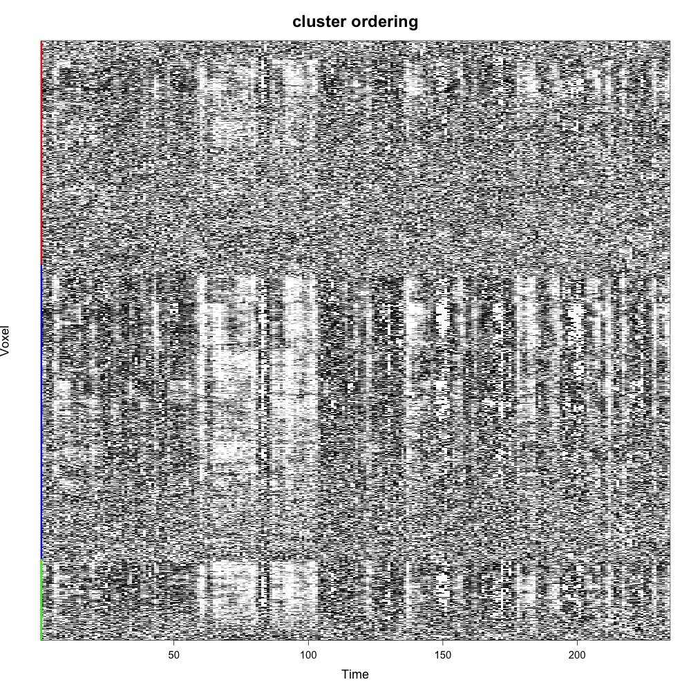
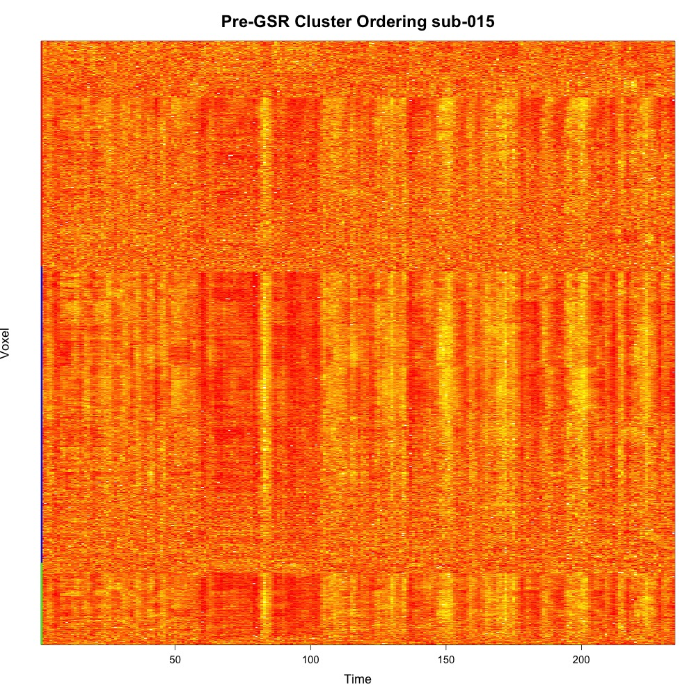

  

#### `CarpetplotR.R` is a commandline tool written in R, for fast and easy visualization of fMRI data quality using carpet plots.

## Background 

Carpet plots are becoming a increasing popular way to visualize
subject-level fMRI scan quality. The plot visualises a matrix of
colour-coded signal intensities, in which rows represent voxels and
columns represent time. The order in which these voxels are displayed
has a major effect on the visual interpretation of carpet plots. Please
see these two papers for more details:  

-   [Identifying and removing widespread signal deflections from fMRI
    data: Rethinking the global signal regression
    problem](https://www.sciencedirect.com/science/article/pii/S1053811920301014?via%3Dihub)

-   [A simple but useful way to assess fMRI scan
    qualities](https://www.sciencedirect.com/science/article/abs/pii/S1053811916303871)

## Installation 

Either download the `carpetplotR.R` script directly this git page, or
using commandline:

      wget  https://raw.githubusercontent.com/sidchop/carpetplotR/main/carpetplotR.R

## Requirements  

-   R
-   The other required R CRAN packages (“optparse”, “RColorBrewer”,
    “matrixStats”,“shape”, “RNifti”) will be automatically downloaded
    and installed the first time you call `carpetplotR.R`.

## Inputs 

-   *\[Required\]* fMRI data file (.nii or .nii.gz format)
-   *\[Recommended\]* Tissue mask file where Grey matter = 1, white
    matter = 2 & csf = 3 (.nii or .nii.gz format). If you have used
    fmriprep to process your data, this can be the
    `${subj}_bold_space-${template}_dseg.nii.gz` file. If you do not
    provided this mask, a brain mask will be generated which will
    include all voxels with a mean value &gt; 0.
-   *\[Optional\]* A text file with the global signal given as a vector.
    If you do not provide this, the global signal will be automatically
    calculated from the provided fMRI file.

## Usage 

You can call R scripts from a command-line terminal using the `Rscript`
command. The most basic use of carpetplotR using defaults would be:  

    Rscript  carpetplotR.R -f fmri_file.nii.gz

Which would by defult result in two carpet plots images (.jpeg) being
generated, one with random voxel ordering and one with global signal
ordering:  

For a discussion of voxel ordering in carpet plots see
[here](https://bmhlab.github.io/DiCER_results/).  

It is highly recommended that you provide a tissue mask. If you do not,
a mean mask will automatically be applied which will only include all
voxels where the mean signal is greater than the mean global signal.
There is no guarantee that this mask will provide good coverage of the
brain.  

If a tissue mask is provided, then voxels will first be ordered by
tissue type:  

    Rscript  carpetplotR.R -f fmri_file.nii.gz -m mask_dseg.nii.gz

CarpetplotR also offers hierarchical average linkage clustering on
Euclidean distances (-r “co”). Computing this can require a lot of RAM,
so please consider downsampling the data using the “-d” flag:  

    Rscript  carpetplotR.R -f fmri_file.nii.gz -m mask_desg.nii.gz -r "co" -d 6

There are other options available such as chaning the colour palette,
max/min colour limits, plot title and format of output image:  

    Rscript  carpetplotR.R -f fmri_file.nii.gz -m mask_desg.nii.gz -r "co" -d 8 -l 3 -c "red,yellow" -i "tiff" -t "Pre-GSR Cluster Ordering sub-015" -o "sub-015_co_"

There are other options, which can be accessed by calling
`Rscript carpetplotR.R` without any options or
`Rscript carpetplotR.R --help`:

    Rscript carpetplotR.R --help

    Usage: carpetplotR.R [options]

    Options:
        -f FILE, --file=FILE
            [Required] fMRI file in .nii or .nii.gz format.
     Minimal useage:

                   Rscript carpetplotR.R -f fmri_file.nii.gz

        -m MASK, --mask=MASK
            [Recommended] Tissue mask file in .nii or .nii.gz format which matches the 3D dimentions of the fMRI file,
                   where the voxels are labelled:  1=gm, 2=wm & 3=csf. If you have run fmriprep
                   you can use the '${subj}_bold_space-${template}_dseg.nii.gz' file. If you provide a mask file,
                   the voxels will first be sorted acording to tissue type.
     Recommended useage:
      
                   Rscript carpetplotR.R -f fmri_file.nii.gz -m bold_space_dseg.nii.gz

        -o OUTPUT_FILENAME, --output_filename=OUTPUT_FILENAME
            Output file path and name [default= carpetplot].
     E.g. 
                   Rscript carpetplotR.R -f fmri_file.nii.gz -o "path/to/output/subj"

        -r CHARACTER, --ordering=CHARACTER
            Voxel ordering: random, gs (global signal) and or co (cluster ordering).
     E.g. -r "random, gs" [Default]

        -g GS, --gs=GS
            a .txt file with the global signal (gs), if not provided, gs will be extracted from provided fmri

        -i IMAGE, --image=IMAGE
            image device to use: "jpeg" [Default], png or tiff

        -c COLOURPALETTE, --colourpalette=COLOURPALETTE
            Colour palette used for the carpet plot. Entered as individual colors (either name or hex) which are combined into a continuous scale, e.g. "black, white" [Default]

        -l LIMITS, --limits=LIMITS
            [Optional] a sets a +upper and -lower z-score limit on the color bar. Default = 1.2. Stops outliers dominating colour scale

        -t TITLE, --title=TITLE
            [Optional] A title that will appear at the top of the plot. 

        -d DOWNSAMPLEFACTOR, --downsamplefactor=DOWNSAMPLEFACTOR
            [Optional] downsample the image by a factor. Highly recommend using a factor between 6-10 when using cluster ordering (i.e. -o "co"), as it can take a lot of RAM.

        -s IMAGESIZE, --imagesize=IMAGESIZE
            [Optional] Size (height & width) of the image in pixels. Default is 1000. If the images are comming out blank, try uping the size

        -R USERASTER, --useRaster=USERASTER
            [Optional] Use raster graphics. Speeds things up a lot, but if you are using carpetplotR on a cluster and the plots are comming out blank, set to False.

        -h, --help
            Show this help message and exit

### Troubleshooting 

-   Output is a blank image? Try increasing the image size (-s 1500).
-   Still blank? Try turning off raster graphics (-R FALSE). Sometimes
    computing clusters dont play nice with raster graphics.
-   Script crashes due to low memory/RAM? Try increasing the
    downsampling factor (e.g. -d 8)
-   Taking too long? Try increasing the downsampling factor (e.g. -d 8)

### Report bugs or requests

Don’t hesitate to ask for support or new features using [github
issues](https://github.com/sidchop/carpetplotR) or email me at
<a href="mailto:sid.chopra@monash.edu" class="email">sid.chopra@monash.edu</a>.
